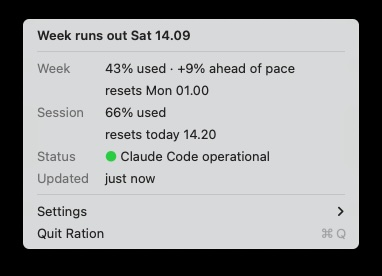

# Ration

A macOS menu bar meter for Claude Code usage.

<p>
  
  &nbsp;&nbsp;
  
</p>

Claude Code's status line already shows your session usage. Ration adds two
things: whether you're ahead of the week's pace, and (when a session runs dry)
the time you get it back.

## Install

Needs macOS 13+, Claude Code, and a Claude Pro or Max subscription.

```bash
brew tap polgarp/tap
brew install ration
open "$(brew --prefix)/opt/ration/Ration.app"
```

Then **Settings → Set up Ration…**, which shows the change it will make to
`settings.json`.

Ration builds on your machine, so nothing is downloaded and nothing is
quarantined. Building needs only the Command Line Tools, and takes a few
seconds.

<details>
<summary>Without Homebrew</summary>

```bash
git clone https://github.com/polgarp/ration.git
cd ration && ./build.sh
cp -R build/Ration.app /Applications/
open /Applications/Ration.app
```
</details>

## Use

The menu bar shows how much of your **week** is spent, since Claude Code already
reports the session. When a session runs out, the time you get it back appears
beside it: `41% · 1h 12m`.

**Settings** holds **Open at Login** and **Undo Setup…**. Everything also works
from the terminal:

```bash
ration --status        # not configured | wrapped | unwrapped: <command>
ration --install       # same as "Set up Ration…"
ration --uninstall     # same as "Undo Setup…"
ration --login-on      # or --login-off
ration --dump          # print what the menu would say
```

## How it works

Ration reads the documented
[`rate_limits`](https://code.claude.com/docs/en/statusline) from Claude Code's
status line.

Setup wraps whatever status line command you already have:

```jsonc
// before
"command": "bash ~/.claude/statusline.sh"
// after
"command": "bash ~/.claude/claude-usage-tap.sh 'bash ~/.claude/statusline.sh'"
```

Your command is passed on as a single quoted string and run by a shell, so
pipelines and `&&` survive; your status line keeps rendering byte-identically.
The wrapper installs to `~/.claude/`, not inside the app bundle, so deleting
Ration can't break your status line.

Every Claude Code session writes that same file, and sessions left idle
rebroadcast windows that have already expired. Ration keeps whichever reading is
genuinely newest rather than whichever landed last.

## Privacy

- **`~/.claude/usage-snapshot.json`** holds the status line payload, which
  includes your working directory, session id and model — the same data Claude
  Code already keeps in the same folder. Created `0600`, never leaves the
  machine.
- **One network call**: `status.claude.com/api/v2/summary.json` every 5 minutes,
  for the service health row. Public and unauthenticated, over an ephemeral
  session with cookies refused — nothing about you in the request.
- Nothing else. No analytics, no telemetry, no update pings.

## Uninstall

**Settings → Undo Setup…** restores your own status line command exactly as it
was, and deletes the saved usage data and the login item. `settings.json` is
backed up first. Then `brew uninstall ration`.

## Limitations

- Only sees Claude Code. Usage from the desktop app and claude.ai counts against
  the same budgets but is invisible here.
- Per-model buckets (Opus, Fable, overage) come from undocumented fields that
  could change.
- `rate_limits` refreshes only after an API response, so a window can outlive
  its payload. Ration says "Usage window has reset" rather than guessing.

## Building

Needs only Xcode Command Line Tools.

```bash
./build.sh                  # -> build/Ration.app, universal
./run-tests.sh              # unit tests, then the status line tests
./Tests/test-installer.sh   # settings.json rewriting, against fixtures
```

There's no `swift test` — XCTest needs a full Xcode install, so the harness is
40 lines instead.

## License

MIT. Unofficial and unaffiliated; see [NOTICE.md](NOTICE.md) — this project
ships no Anthropic branding and none may be added.
